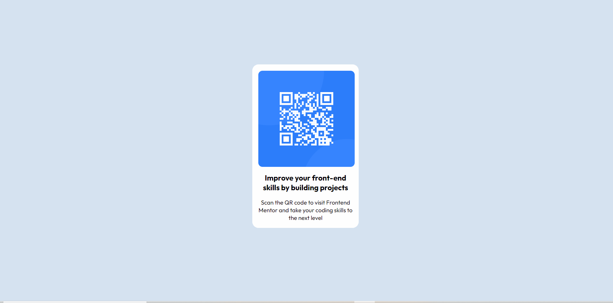

# Frontend Mentor - Card component

## Desafio ✨

Proposto pelo [Frontend Mentor](https://www.frontendmentor.io) , esse é um card simples que contém uma imagem, um título e um parágrafo. Com esse desafio foi possível praticar alguns conceitos básicos do HTML e CSS, como a estruturação de classes e tags, além da utilização de flex para posicionamentos e variáveis no CSS.

 

## Detalhes importantes:
- Download de fontes do Google e ícones do Font Awesome.
- Responsividade desktop e mobile.
- Utilização de propriedades como o flex.

 

## Tecnologias utilizadas

   
  
  

